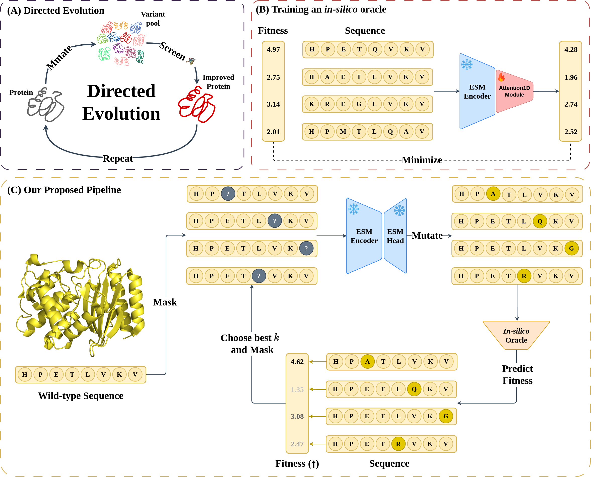

<div align="center">

# Protein Design by Directed Evolution guided by Large Language Models
</div>

Contributors:
* Tran Van Trong Thanh
* Truong Son Hy (PI / Correspondent)

Paper: [https://doi.org/10.1109/TEVC.2024.3439690](https://doi.org/10.1109/TEVC.2024.3439690)

## Table of Contents:

- [Introduction](#introduction)
- [Structure Description](#structure-description)
- [Installation](#installation)
- [Usage](#usage)
    - [Training](#training)
    - [Inference](#inference)
- [Citation](#citation)
- [License](#license)

## Introduction
This is the official implementation of the paper [Protein Design by Directed Evolution guided by Large Language Models](https://www.biorxiv.org/content/10.1101/2023.11.28.568945v2).

|  | 
|:--:| 
| ***(A)** Workflow of traditional directed evolution. **(B)** We train the in-silico oracle as the “ground-truth” evaluator to predict the fitness score of each generated sequence. **(C)** Our proposed MLDE framework.* |

## Structure description

Our repository is structured as follows:
```python
.
  |-assets
  |-README.md
  |-LICENSE
  |-preprocessed_data        # training data
  |-requirements.txt   
  |-scripts
  |  |-train_decoder.py      # trains oracle
  |  |-run_de.sh             # Shell file to run
  |  |-run_discrete_de.py    # Python file to run
  |  |-preprocess            # contains codes to preprocess data
  |-exps
  |  |-results               # results stored here
  |  |-logs                  # logs stored here
  |  |-checkpoints           # checkpoints stored here
  |-setup.py
  |-de                       # contains main source code
```

## Installation

You should have Python 3.10 or higher. I highly recommend creating a virtual environment like conda. If so, run the below commands to install:

```shell
git clone https://github.com/HySonLab/Directed_Evolution.git 
cd Directed_Evolution 

conda create -n mlde python=3.10 -y 
conda activate mlde

pip install -e .
```

## Usage

### Training

To train the oracle (i.e., Attention1D) on certain dataset (e.g., AAV), simply run:
```shell
python train_decoder.py \
    --data_file /path/to/AAV.csv \
    --dataset_name AAV \
    --pretrained_encoder facebook/esm_t12_35M_UR5D \
    --dec_hidden_dim 1280 \
    --batch_size 256 \
    --ckpt_path /path/to/ckpt_to_continue_from \
    --devices 0 \
    --grad_accum_steps 1 \
    --lr 5e-5 \
    --num_epochs 50 \
    --num_ckpts 2 \
```
If you want to train the model without using WandB, just prepending `WANDB_DISABLED=True` to the command like below

```shell
WANDB_DISABLED=True python train_decoder.py ...
```

Arguments list:
```shell
options:
  -h, --help            show this help message and exit
  --data_file DATA_FILE
                        Path to data directory.
  --dataset_name DATASET_NAME
                        Name of trained dataset.
  --pretrained_encoder PRETRAINED_ENCODER
                        Path to pretrained encoder.
  --dec_hidden_dim DEC_HIDDEN_DIM
                        Hidden dim of decoder.
  --batch_size BATCH_SIZE
                        Batch size.
  --ckpt_path CKPT_PATH
                        Checkpoint of model.
  --devices DEVICES     Training devices separated by comma.
  --output_dir OUTPUT_DIR
                        Path to output directory.
  --grad_accum_steps GRAD_ACCUM_STEPS
                        No. updates steps to accumulate the gradient.
  --lr LR               Learning rate.
  --num_epochs NUM_EPOCHS
                        Number of epochs.
  --wandb_project WANDB_PROJECT
                        WandB project's name.
  --seed SEED           Random seed for reproducibility.
  --set_seed_only       Whether to not set deterministic flag.
  --num_workers NUM_WORKERS
                        No. workers.
  --num_ckpts NUM_CKPTS
                        Maximum no. checkpoints can be saved.
  --log_interval LOG_INTERVAL
                        How often to log within steps.
  --precision {highest,high,medium}
                        Internal precision of float32 matrix multiplications.
```

### Inference

After having oracle's checkpoint corresponding to a dataset (e.g., AAV), you can generate novel proteins by running:
```shell
python run_discrete_de.py \
    --wt DEEEIRTTNPVATEQYGSVSTNLQRGNR
    --wt_fitness -100 \
    --n_steps 60 \
    --population 128 \
    --num_proposes_per_var 4 \
    --k 1 \
    --rm_dups \
    --population_ratio_per_mask 0.6 0.4 \
    --pretrained_mutation_name facebook/esm2_t12_35M_UR50D \
    --dec_hidden_size 1280 \
    --predictor_ckpt_path /path/to/ckpt \
    --verbose \
    --devices 0 \
```

Arguments list:
```shell
options:
  -h, --help            show this help message and exit
  --data_file DATA_FILE
                        Path to data file.
  --wt WT               Amino acid sequence.
  --wt_fitness WT_FITNESS
                        Wild-type sequence's fitness.
  --n_steps N_STEPS     No. steps to run directed evolution.
  --population POPULATION
                        No. population per step.
  --num_proposes_per_var NUM_PROPOSES_PER_VAR
                        Number of proposed mutations for each variant in the pool.
  --k K                 Split sequence into multiple tokens with length `k`.
  --rm_dups             Whether to remove duplications in the proposed candidate pool.
  --population_ratio_per_mask POPULATION_RATIO_PER_MASK [POPULATION_RATIO_PER_MASK ...]
                        Population ratio to run per masker.
  --pretrained_mutation_name PRETRAINED_MUTATION_NAME
                        Pretrained model name or path for mutation checkpoint.
  --dec_hidden_size DEC_HIDDEN_SIZE
                        Decoder hidden size (for conditional task).
  --predictor_ckpt_path PREDICTOR_CKPT_PATH
                        Path to fitness predictor checkpoints.
  --num_masked_tokens NUM_MASKED_TOKENS
                        No. masked tokens to predict.
  --mask_high_importance
                        Whether to mask high-importance token in the sequence.
  --verbose             Whether to display output.
  --seed SEED           Random seed.
  --set_seed_only       Whether to enable full determinism or set random seed only.
  --result_dir RESULT_DIR
                        Directory to save result csv file.
  --save_name SAVE_NAME
                        Filename of the result csv file.
  --devices DEVICES     Devices, separated by commas.
```

## Citation
If our paper aids your work, please kindly cite our paper using the following bibtex
```bibtex
@ARTICLE{10628050,
  author={Tran, Thanh V. T. and Hy, Truong Son},
  journal={IEEE Transactions on Evolutionary Computation}, 
  title={Protein Design by Directed Evolution Guided by Large Language Models}, 
  year={2025},
  volume={29},
  number={2},
  pages={418-428},
  keywords={Proteins;Evolution (biology);Large language models;Optimization;Transformers;Protein engineering;Task analysis;Directed evolution;large language models (LLMs);machine learning (ML);protein engineering},
  doi={10.1109/TEVC.2024.3439690}}

```

## License

[GPL-3.0 License](./LICENSE)
